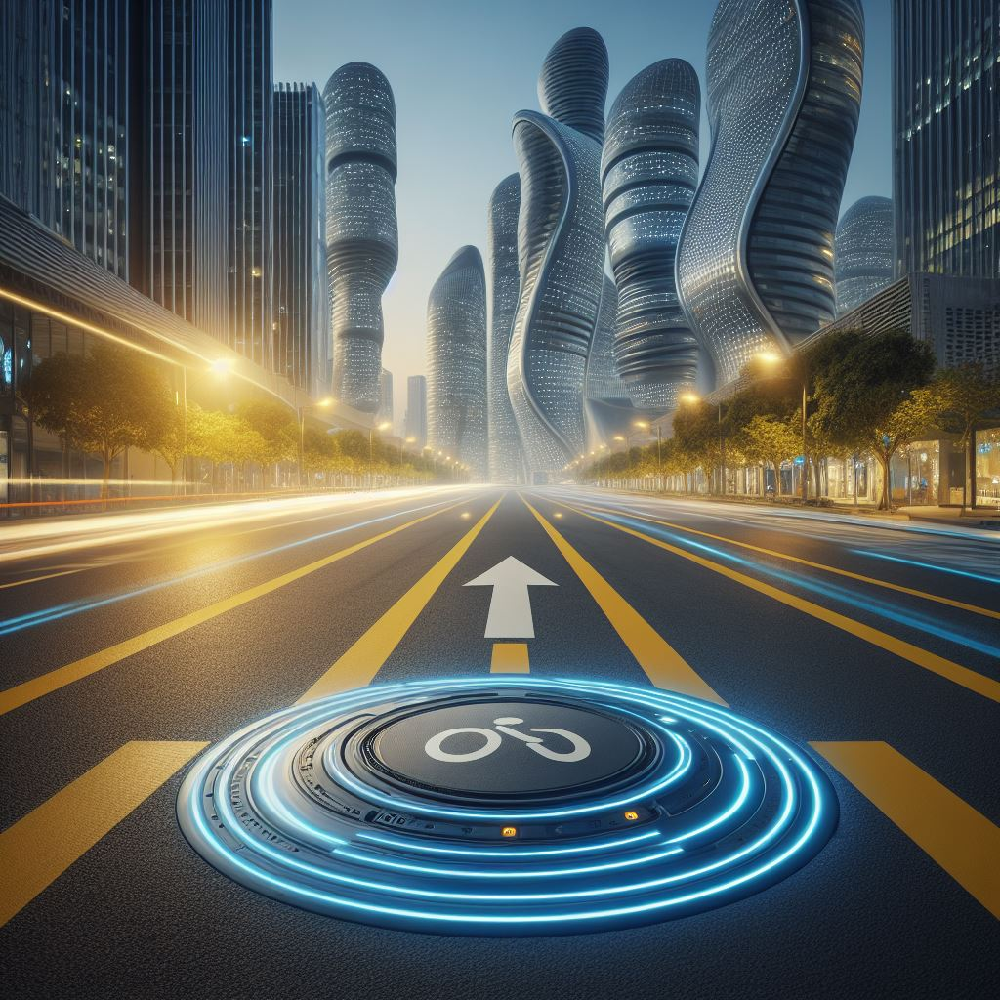
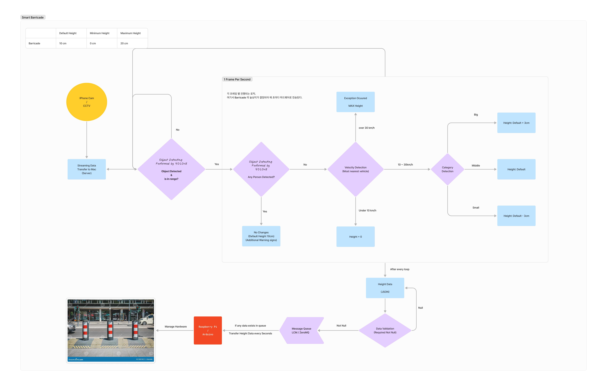

# capstone_design2 - Smart Barricade

# 프로젝트 아키텍쳐

# 날짜 별 진행 사항
<!-- - [제목](이슈 링크) 형태로 작성하시면 됩니다. -->

## 조민제
- [24.03.16 YoloV8을 이용한 CCTV 영상속 차량탐지 성공, resizing또한 정상적으로 적용됨.]
- [24.04.03 모터 첫 가동 성공]  
- [24.04.09 라즈베리파이를 이용한 아두이노로 모터 제어 성공](https://github.com/CapstoneDesignCSE/capstone_design2/issues/4)  
## 김시온

## 송도현

## 채승민
- [24.03.17 YoloV8 아이폰 캠 연동 테스트 성공](https://github.com/CapstoneDesignCSE/capstone_design2/issues/3)
- [24.03.24 Supervision 을 활용한 객체 속력 측정 성공]
- [24.04.10 프로젝트 아키텍쳐 구축]

# References
## Docs
### 속도 측정
- [X] [YOLOv8 객체 속도 측정 - Ultralystics](https://docs.ultralytics.com/ko/reference/solutions/speed_estimation/)
- [X] [객체 속도 측정 - Roboflow](https://blog.roboflow.com/estimate-speed-computer-vision/)

## SourceCode
### 속도 측정
- [X] [객체 속도 측정 - Roboflow 코랩 시뮬레이션](https://colab.research.google.com/github/roboflow-ai/notebooks/blob/main/notebooks/how-to-estimate-vehicle-speed-with-computer-vision.ipynb?ref=blog.roboflow.com)

## Blog
- [X] [YOLOv5 커스텀 데이터 학습 - M1 Mac, iphone](https://clap0107.tistory.com/7)
- [X] [객체 탐지 데이터 셋](https://public.roboflow.com/object-detection)

## Youtube
### 속도 측정
- [X] [객체 속도 측정 - Roboflow](https://youtu.be/uWP6UjDeZvY)
